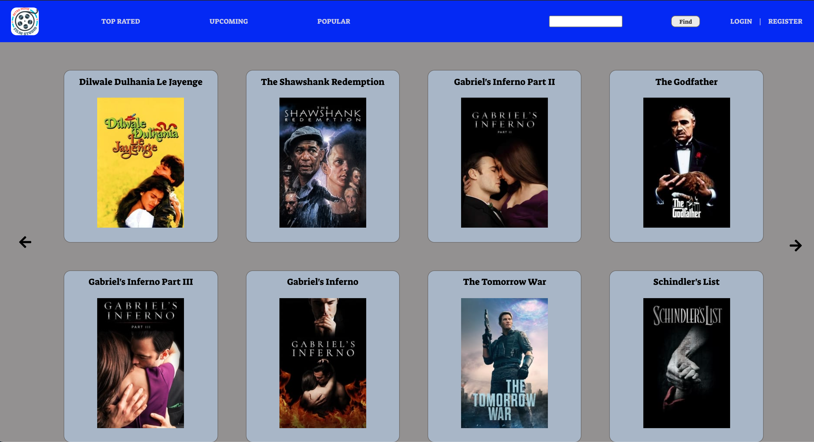
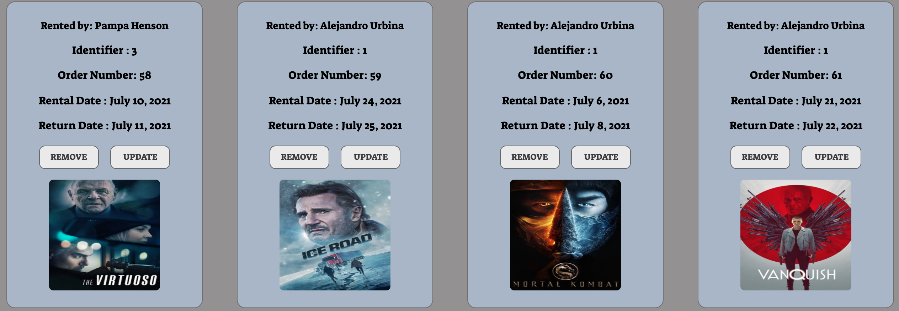

<h1 align ="center"> Retro Movie </h1>
<br>

Project carried out for [Geeks Hubs](https://geekshubsacademy.com/) by [Alejandro](https://github.com/2020-JAUG).

The challenge is to develop a back-end and a front-end for movie rental.

<b>Start: 28 June  end: 4 July 2021.</b>

For its development, I have relied on the good practices offered by <b> GitFlow. </b>

# <h1 align ="center"> Index </h1>

- [¿What is it? 🧐](#¿Qué-es?)
- [Requirements ⚙️](#requisitos)
- [Safety 🔐](#seguridad)
- [Technologies](#tecnologías)

# <h1 align ="center"> What is it?  </h1>

From the product, they ask us to create a visual part for an application of movie rental <b>API</b> [The Movie Database](https://developers.themoviedb.org/3/getting-started/introduction) Storing the data in our database (<b>MySQLWorkbench</b>). In which you can register as a user, log in to search for movies and rent them, you can also make changes to your profile and rented movies<br>

<h1 align ="center"> Home  </h1>

<h1 align ="center"> Detail  </h1>

<h1 align ="center"> Orders </h1>



<br/><br/>
<h4 align ="center"> Example of a search by title</h4>


```JavaScript
    axios
    .post("http://localhost:3001/moviesearch", body)
    .then((res) => {

        props.dispatch({type:ADD_MOVIESpayload: res.data.results});
        document.getElementById("title"value = "";
        history.push('/moviesgenre');
    })
    .catch(() => {
    return Error("Lost data");
});
```

<h1 align ="center"> Requirements ⚙️</h1>

- [Descargar](https://nodejs.org/es/) e Instalar <b>Node.</b>
```
    $ npm install node
```
- Instalar <b>Axios.</b>
```
    $ npm install axios
```
- Instalar <b>Express.</b>
```
    $ npm install express.
```

# <p align ="center"> Safety 🔐</p>

For the security part use <b>jsonwebtoken</b> and <b>bcrypt</b>.
<br>
- Instalar <b>jsonwebtoken</b>
````
    $ npm install jsonwebtoken
````
- Instalar <b>bcrypt</b>

````
    $ npm install bcrypt
`````


# <p align ="center">Technologies 💻</p>

 <a href="https://git-scm.com/" target="_blank">  <a href="https://developer.mozilla.org/en-US/docs/Web/JavaScript" target="_blank">  </a><a href="https://nodejs.org" target="_blank"> <a href="https://postman.com" target="_blank">    </a> </a> </a>
